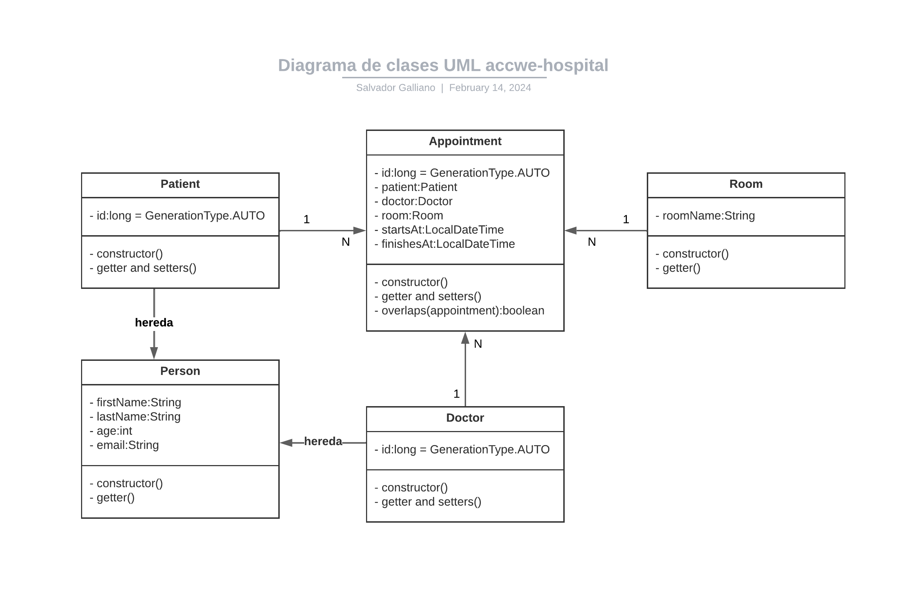

# AccWe Hospital

Este proyecto tiene como objetivo renovar el sistema de control de citas en el hospital AccWe, que ha experimentado una serie de ataques informáticos recientes. El sistema anterior se ha revisado y limpiado para evitar posibles errores, priorizando la actualización de librerías y tecnologías.

## Requisitos para Utilizar el Proyecto

- Java 8 o superior
- Maven
- Docker

## Crear Imágenes Docker

- docker build -t accwe-hospital-mysql -f Dockerfile.mysql .

- docker build -t accwe-hospital-api -f Dockerfile.maven .

## Crear contenedores Docker

- docker run -d -p 3306:3306 --name accwe-mysql-container accwe-hospital-mysql:latest

- docker run -d -p 8080:8080 --name accwe-api-container accwe-hospital-api:latest

## UML diagram

